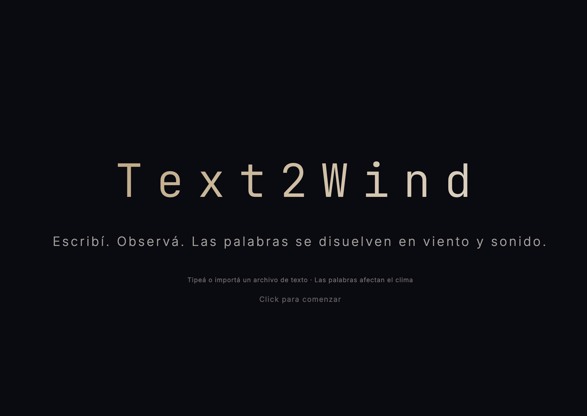

# Text2Wind — Interfaz Espigadora


> *"Nada es realmente un desecho si se mira con la atención adecuada."*
> — Agnès Varda, *Los espigadores y la espigadora* (2000)

Una experiencia web inmersiva donde las palabras escritas nacen como tipografía viva, respiran en un paisaje atmosférico sincronizado con la hora real del día, y se disuelven en viento, sonido y silencio.

**Las palabras que escribís afectan el mundo.** Escribir *"lluvia"* nubla el cielo. *"Silencio"* detiene el viento. *"Memoria"* revela las huellas de todo lo que fue escrito antes.

🔗 **[GitHub](https://github.com/vlasvlasvlas/text2wind)**

---

## Concepto

Text2Wind transpone el gesto del **espigueo** de Varda a una interfaz digital:

1. **Espigar materia** — Las letras destruidas se acumulan como restos tipográficos. De esos restos crece hierba. El desecho alimenta nueva vida.
2. **Espigar imágenes** — Cuando el sistema detecta una palabra con carga semántica, la contempla un instante antes de liberarla al viento.
3. **Espigar el tiempo** — La interfaz envejece con el uso real. Cada sesión deja marcas persistentes (palimpsesto digital).

---

## Características

### Visuales
- 🌅 **Cielo procedural** sincronizado con la hora real (brillo cálido del sol de día, halo lunar de noche, estrellas)
- ☁️ **Nubes orgánicas** renderizadas con gradientes radiales y animación de ruido
- 💨 **Campo de viento** basado en Perlin noise con turbulencias orgánicas
- 🌫️ **Partículas de viento** (polvo/polen) que visualizan la dirección y fuerza del viento
- 🪲 **Bichos atmosféricos**: Luciérnagas de noche y cigarras de día, con densidad y visibilidad configurable
- ✍️ **Tipografía viva** con ciclo de vida: nacimiento → reposo → erosión → disolución
- 🎨 **Color de texto** configurable por hue (0–360°) o automático según hora
- 📸 **Arte ASCII**: Inyección generativa de figuras ASCII al tipear palabras mapeadas, sujetas a físicas de viento y erosión
- 🔤 **Tipografía seleccionable**: JetBrains Mono, Courier New, Fira Code, Source Code Pro, Ubuntu Mono, IBM Plex Mono — todas monospace para soporte ASCII art
- ⏱️ **Persistencia configurable**: cuántos segundos permanece el texto visible (2–120s)
- 💥 **Explosión configurable**: cantidad de partículas por letra al erosionarse (5–200)
- 🌧️ **Clima parametrizable**: viento, dirección, lluvia, niebla, tormenta, temperatura
- ⚡ **Efectos meteorológicos**: lluvia con gotas, relámpagos, niebla volumétrica
- 🕯️ **Cursor-vela** con estela de luciérnagas: tu atención protege las letras del olvido
- 🌿 **Hierba que crece** sobre el texto abandonado y los bordes (densidad configurable)
- 📜 **Palimpsesto digital**: huellas invisibles de texto pasado (con switch de apagado y control de retención)

### Sonido — 3 Capas Generativas
- 🥁 **Ritmo**: percusión generada por la erosión de letras + clicks al teclear
- 🎵 **Drone**: tono FM continuo y evolutivo que cambia de forma fluida con la hora exacta del día, temperatura y clima
- 🎹 **Melodía**: notas al teclear con dos modos:
  - **Random**: notas basadas en la escala musical activa, seleccionable desde la UI o automática por clima
  - **Piano QWERTY**: el teclado mapeado como un piano (Z-M = C3, Q-P = C5)
- 🎼 **18 escalas musicales** configurables desde `data/scales.json` (pentatónica, blues, hirajōshi, húngara menor, etc.)
- 🔔 **Feedback Semántico**: Un arpegio luminoso ("chime") suena exclusivamente al descubrir una palabra clave oculta
- 📱 **Soporte Móvil**: Desbloqueo de contexto de audio sincrónico para total compatibilidad con Safari iOS y Android
- Cada capa tiene controles independientes de **volumen, mute, waveform, ADSR, reverb y delay**
- La escala musical puede ser fija o cambiar automáticamente con el clima

### Interacción
- 🖱️ **Click para posicionar**: el cursor de escritura queda fijo donde hacés click
- 📋 **Pegar texto (Ctrl+V / Cmd+V)**: pegá texto del portapapeles — todas las letras aparecen de golpe con su sonido
- 🧠 **Motor Semántico Inclusivo**: Ignora acentos para buscar coincidencias (`corazon` dispara lo mismo que `corazón`)
- ⭐ **16+ palabras especiales** con efectos únicos de cámara, partículas, y eventos apoteósicos
- 📖 **Auto-typewriter**: importá un archivo `.txt` (UTF-8) y se escribe solo al BPM elegido (10–400)
- 🎭 **Modo performance** (F11) para instalación/galería sin UI
- 📷 **Captura de pantalla** como PNG
- ⚠️ **Sin shortcuts de letras**: todas las teclas se usan para escribir, sin conflictos

### UI
- 🕐 **Reloj** sincronizado con la hora del sistema
- ⚙️ **Panel de parámetros** con 6 tabs: Clima · Texto · Ritmo · Drone · Melodía · Auto
- ❓ **Panel "¿Qué es esto?"** con la teoría, concepto de Varda y link a GitHub
- ⌨️ **Panel de atajos** de teclado
- ⛶ **Botón de pantalla completa** (solo por botón, no por tecla)
- 6 botones flotantes: ❓ About · ⌨️ Atajos · ⛶ Fullscreen · 📷 Captura · 🔇 Sonido · ⚙️ Params

---

## Instalación

```bash
# Clonar
git clone https://github.com/vlasvlasvlas/text2wind.git
cd text2wind

# Instalar dependencias
npm install

# Ejecutar en desarrollo
npm run dev
```

Abrir **http://localhost:5173**

### Build de producción

```bash
npm run build     # Genera dist/
npm run preview   # Previsualiza el build
```

### Generar / Regenerar el diccionario semántico

```bash
# Instalar dependencias Python
pip install -r tools/requirements.txt
python -m spacy download es_core_news_lg

# Generar diccionario (360 palabras + 16 especiales)
python tools/generate_dictionary.py

# Extender con palabras custom
python tools/generate_dictionary.py --extend --words "soledad,ceniza,horizonte"

# Testear cobertura
python tools/generate_dictionary.py --test
```

---

## Uso

### Controles básicos

| Acción | Cómo |
|--------|------|
| Iniciar | Click en la pantalla de inicio |
| Escribir | Teclear — las letras aparecen donde hiciste click |
| Pegar texto | `Ctrl+V` / `Cmd+V` — todas las letras aparecen al instante con sonido |
| Posicionar cursor | Click en el canvas (queda fijo ahí) |
| Erosionar línea | `Enter` — las letras se disuelven en cascada |
| Pantalla completa | Botón ⛶ en la barra flotante |
| Modo performance | `F11` — oculta toda la UI + fullscreen |
| Cerrar panel | `Escape` |
| Capturar imagen | Botón 📷 |
| Activar sonido | Botón 🔇/🔊 |

> **Nota:** Todas las teclas de letras, espacio y backspace se usan exclusivamente para escribir. No hay shortcuts que conflictúen con la escritura.

### Auto-typewriter

1. Abrí el panel ⚙️ → tab **📖 Auto**
2. Click en **📂 Importar archivo .txt**
3. Ajustá el **BPM** (velocidad de tipeo: 10–400)
4. **▶ Reproducir** / **⏸ Pausar** / **⏹ Stop**

El texto importado se escribe automáticamente, caracter por caracter, con sonido y detección semántica. Soporta archivos con acentos y caracteres especiales (UTF-8).

### Controles de texto (tab ✍️ Texto)

| Control | Rango | Default | Descripción |
|---------|-------|---------|-------------|
| Persistencia | 2 – 120s | 8s | Cuánto tiempo permanecen las letras antes de erosionarse |
| Explosión | 5 – 200 | 60 | Cantidad de partículas que genera cada letra al morir |
| Color | 0 – 360° | Auto | Hue del color de las letras (0 = automático según hora) |
| Tipografía | dropdown | JetBrains Mono | Fuente monospace — compatible con ASCII art |
| Tamaño | 12 – 72px | 28px | Tamaño de la tipografía (el interlineado se ajusta automáticamente) |

#### Tipografías disponibles

| Fuente | Característica |
|--------|----------------|
| JetBrains Mono | Moderna, excelente legibilidad |
| Courier New | Clásica, presente en todos los sistemas |
| Fira Code | Ligaduras de código |
| Source Code Pro | Adobe, profesional |
| Ubuntu Mono | Linux, compacta |
| IBM Plex Mono | Corporativa, elegante |
| System Mono | Monospace del sistema operativo |

### Palabras especiales

| Palabra | Efecto |
|---------|--------|
| *espigar* / *espiga* / *desecho* / *basura* | Partículas muertas se levantan del suelo |
| *memoria* / *recuerdo* | El palimpsesto se hace visible |
| *silencio* | Todo se detiene — suspensión contemplativa |
| *reloj* / *tiempo* | Time-lapse hiperrápido (ciclo de 24h en 2.5s) |
| *corazón* / *papa* | Partículas forman un corazón (la papa de Varda) |
| *varda* | Revelación total + suspensión |
| *muerte* | Erosión simultánea de todas las letras |
| *obsoleto* | La interfaz envejece rápidamente |
| *nacer* | Hierba brota de los restos tipográficos |
| *escarabajo* (o mapeadas en ASCII) | Inyecta un dibujo tipográfico 2D (ASCII art) destructible |
| *posnetes* | Evento Apoteósico: Acordes masivos, tormenta, enjambre de bichos, polarización y caos total |

### Modo Piano QWERTY

Cuando el modo de melodía está en **Piano (QWERTY)**, el teclado se mapea como un piano:

```
Octava alta (C5):  Q W E R T Y U I O P
Teclas negras:     2 3   5 6 7   9 0

Octava media (C4): (misma distribución con el segundo mapeo)

Octava baja  (C3): Z X C V B N M
Teclas negras:     S D   G H J
```

---

## Arquitectura

```
text2wind/
├── index.html              # Estructura + paneles UI (5 tabs, 3 paneles flotantes)
├── styles.css              # Diseño glassmorphism + tabs + toggles + floating bar
├── vite.config.js          # Configuración Vite
├── package.json            # Dependencias (Three.js, Tone.js, Vite)
│
├── src/
│   ├── main.js             # Orquestador: loop, eventos, auto-typewriter
│   ├── config.js           # Constantes globales
│   │
│   ├── sky.js              # Cielo procedural + nubes + estrellas + partículas de viento
│   ├── wind.js             # Campo de viento Perlin noise
│   ├── weather.js          # Estado meteorológico (máquina de estados)
│   │
│   ├── text.js             # Tipografía viva (ciclo de vida de letras)
│   ├── particles.js        # Partículas de erosión
│   ├── cursor.js           # Cursor-vela + estela de luciérnagas
│   ├── memory.js           # Palimpsesto + envejecimiento
│   │
│   ├── sound.js            # 3 capas de sonido (ritmo/drone/melodía)
│   ├── semantic.js         # Consumidor de diccionario semántico
│   ├── modes.js            # Detección de modo (escritor/contemplador/tormenta)
│   ├── ui.js               # Controlador UI (tabs, sliders, toggles, file import)
│   │
│   ├── effects/
│   │   ├── rain.js         # Efecto lluvia
│   │   ├── lightning.js    # Relámpagos
│   │   ├── fog.js          # Niebla volumétrica
│   │   └── grass.js        # Hierba sobre texto abandonado
│   │
│   └── utils/
│       ├── math.js         # Funciones matemáticas (lerp, clamp, noise, etc.)
│       └── noise.js        # Implementación Perlin noise
│
├── data/
│   ├── runtime_defaults.json # Defaults globales de arranque (clima/texto/sonido/UI)
│   ├── scales.json         # 18 escalas musicales configurables + mapeos de teclado
│   ├── semantic_dict.json  # Diccionario semántico (360 palabras → efectos)
│   └── special_words.json  # 16 palabras especiales (Varda, memoria, etc.)
│
└── tools/
    ├── generate_dictionary.py  # Generador CLI del diccionario con spaCy
    ├── semantic_poles.json     # Configuración de polos semánticos
    └── requirements.txt        # Dependencias Python
```

### Flujo de datos

```
Teclado → TextEngine → SoundEngine (melodía)
                     → SemanticEngine → Weather (efectos)
                     → ParticleSystem (erosión)
                     → Memory (palimpsesto)

Tiempo real → Weather → Sky (cielo/nubes)
                     → Wind (campo de viento)
                     → SoundEngine (drone/escala)
                     → RainEffect / LightningEffect / FogEffect

Archivo .txt → Auto-typewriter → TextEngine (al BPM elegido)
```

---

## Stack técnico

| Capa | Tecnología |
|------|-----------|
| Rendering | Canvas 2D con animación procedural a 60fps |
| Audio | Tone.js (Web Audio API) — FM Synth, PolySynth, Noise, Reverb, Delay |
| Build | Vite 6.x |
| NLP offline | spaCy + es_core_news_lg (Python, solo para generar diccionario) |
| Deploy | Archivos estáticos (`dist/`) — GitHub Pages, Vercel, Netlify |

### Dependencias runtime

```json
{
  "three": "^0.170.0",
  "tone": "^15.1.3"
}
```

---

## Parámetros de sonido

Cada capa de sonido es independientemente configurable desde la UI:

### 🥁 Ritmo
| Parámetro | Rango | Default | Descripción |
|-----------|-------|---------|-------------|
| Volumen | -40 a 0 dB | -14 dB | Volumen de percusión |
| Attack | 0.001 – 0.5s | 0.002s | Ataque del golpe percusivo |
| Decay | 0.01 – 1.0s | 0.15s | Decaimiento |
| Release | 0.01 – 2.0s | 0.10s | Release |
| Viento (audio) | -50 a -10 dB | -35 dB | Volumen del ruido de viento |

### 🎵 Drone
| Parámetro | Rango | Default | Descripción |
|-----------|-------|---------|-------------|
| Volumen | -40 a -5 dB | -22 dB | Volumen del drone |
| Filtro LP | 50 – 2000 Hz | 400 Hz | Frecuencia del filtro low-pass |
| Attack | 0.5 – 10s | 4s | Ataque (fade in lento) |
| Release | 1 – 15s | 6s | Release (fade out) |
| Onda | sine / triangle / fatsine / fatsawtooth | sine | Forma de onda |

### 🎹 Melodía
| Parámetro | Rango | Default | Descripción |
|-----------|-------|---------|-------------|
| Volumen | -40 a 0 dB | -16 dB | Volumen de notas |
| Modo | Random / Piano | Random | Mapeo de teclas a notas |
| Escala | Auto + 18 escalas | Auto (clima) | Escala musical activa |
| Onda | triangle / sine / square / sawtooth | triangle | Forma de onda |
| Attack | 0.001 – 2.0s | 0.05s | Ataque de nota |
| Decay | 0.05 – 3.0s | 0.60s | Decaimiento |
| Release | 0.1 – 5.0s | 1.5s | Release |
| Reverb | 0 – 1 | 0.35 | Wet del reverb |

---

## Defaults de arranque

Los valores iniciales de sliders, clima y parámetros de sonido se centralizan en `data/runtime_defaults.json`.

- `weather`: estado inicial atmosférico (viento, lluvia, temperatura, hora override, etc.)
- `text`: persistencia, explosión de partículas, tipografía, tamaño y color por hue
- `sound.layers`: volúmenes, mute, ADSR, waveform y modo por capa
- `sound.masterLinear`: ganancia maestra inicial
- `autoTypewriter.bpm`: BPM inicial del auto-typewriter

Esto evita desalineaciones entre UI y motor: al arrancar, los controles se hidratan desde ese JSON y se aplican al engine.

---

## Escalas musicales

Las escalas se cargan desde `data/scales.json`. Desde la UI (tab 🎹 Melod → **Escala**) se puede seleccionar una escala fija o dejar en **Auto (clima)** para que cambie con el tiempo.

### Modo Auto (clima)

| Condición | Escala | Carácter |
|-----------|--------|----------|
| Normal (20°C, sin tormenta) | Pentatónica | Sereno, abierto |
| Tormenta > 50% | Frigia | Tenso, oscuro |
| Temperatura < 5°C | Eólica | Melancólico |
| Temperatura > 30°C | Lidia | Luminoso, expansivo |

### Escalas disponibles (18)

| Escala | Intervalos | Carácter |
|--------|-----------|----------|
| Pentatónica Mayor | 0 2 4 7 9 | Sereno, universal |
| Pentatónica Menor | 0 3 5 7 10 | Blues, melancólico |
| Mayor (Jónica) | 0 2 4 5 7 9 11 | Brillante, estable |
| Menor Natural (Eólica) | 0 2 3 5 7 8 10 | Melancólico |
| Dórica | 0 2 3 5 7 9 10 | Jazz, modal |
| Frigia | 0 1 3 5 7 8 10 | Tenso, flamenco |
| Lidia | 0 2 4 6 7 9 11 | Luminoso, expansivo |
| Mixolidia | 0 2 4 5 7 9 10 | Rock, dominante |
| Blues | 0 3 5 6 7 10 | Blues clásico |
| Cromática | 0-11 (12 notas) | Atonal, experimental |
| Tono Entero | 0 2 4 6 8 10 | Onírico, Debussy |
| Hirajōshi | 0 2 3 7 8 | Japonesa, etérea |
| In-Sen | 0 1 5 7 10 | Japonesa, oscura |
| Húngara Menor | 0 2 3 6 7 8 11 | Gitana, dramática |
| Menor Armónica | 0 2 3 5 7 8 11 | Clásica, tensión |
| Menor Melódica | 0 2 3 5 7 9 11 | Jazz moderno |
| Disminuida | 0 2 3 5 6 8 9 11 | Simétrica, tensa |
| Aumentada | 0 3 4 7 8 11 | Simétrica, etérea |

### Agregar escalas propias

Editá `data/scales.json` y agregá una entrada bajo `"scales"`:

```json
"miEscala": {
  "label": "Mi Escala Custom",
  "notes": [0, 2, 5, 7, 10],
  "baseOctave": 4
}
```

- `notes`: intervalos en semitonos desde la raíz (0 = tónica)
- `baseOctave`: octava base MIDI (4 = C4 / MIDI 60)
- La escala aparece automáticamente en el selector de la UI

La nota raíz del drone cambia con la hora del día: C2 (medianoche) → E2 (mañana) → A2 (mediodía) → D2 (noche).

---

## Deploy

### GitHub Pages

```bash
npm run build
# Subir contenido de dist/ a la rama gh-pages
```

### Vercel / Netlify

Conectar el repositorio directamente. Build command: `npm run build`. Output: `dist/`.

---

## Inspiración

**Agnès Varda**, *Les Glaneurs et la Glaneuse* (2000)

> El acto de espigar — recoger lo que otros descartan — como metáfora de la creación digital. En Text2Wind, las letras no se "borran": se disuelven, sus partículas alimentan el suelo, y de ese suelo crece hierba. Nada se pierde.

---

## Licencia

MIT
